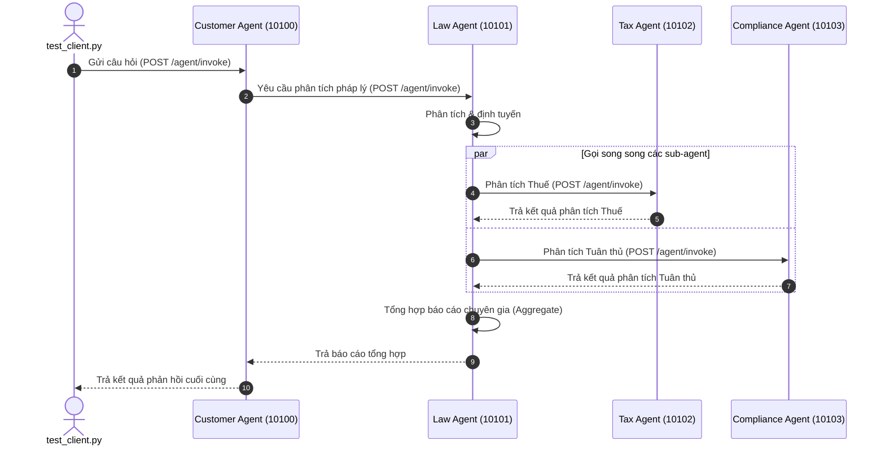

# Lab Solution - Day 09: Multi-Agent System với A2A Protocol

Tài liệu này trình bày lời giải chi tiết và kết quả phân tích cho các bài tập thực hành (Codelabs) của Day 09.

---

## Phần 1: Direct LLM Calling

### 1. LLM được khởi tạo như thế nào? (Hàm `get_llm()`)
Hàm `get_llm()` được định nghĩa trong [common/llm.py](file:///d:/VinAI/Batch02-Day9_Multi-Agent_MCP-A2A/common/llm.py) như sau:
```python
def get_llm() -> ChatOpenAI:
    """Return a ChatOpenAI client pointed at OpenRouter."""
    return ChatOpenAI(
        model=os.getenv("OPENROUTER_MODEL", "anthropic/claude-sonnet-4-5"),
        openai_api_key=os.getenv("OPENROUTER_API_KEY"),
        openai_api_base="https://openrouter.ai/api/v1",
    )
```
- **Cơ chế:** Sử dụng thư viện `langchain_openai.ChatOpenAI`. 
- **Cấu hình:** Endpoint được trỏ tới OpenRouter API (`https://openrouter.ai/api/v1`) để có thể sử dụng linh hoạt các mô hình ngôn ngữ lớn khác nhau (mặc định là `anthropic/claude-sonnet-4-5` nếu không có biến môi trường cấu hình).

### 2. Message gửi đến LLM có cấu trúc gì?
Message gửi đến LLM là một danh sách các message objects từ thư viện LangChain (`list[BaseMessage]`). Cụ thể:
- `SystemMessage`: Định hình vai trò, nhiệm vụ và giới hạn của mô hình (ví dụ: *"You are a legal expert..."*).
- `HumanMessage`: Câu hỏi thực tế từ người dùng (ví dụ: biến `QUESTION`).

### 3. Tại sao cần có `SystemMessage` và `HumanMessage`?
- **SystemMessage:** Cung cấp định hướng hệ thống, hướng dẫn phong cách viết, cách lập luận và cấu trúc phản hồi.
- **HumanMessage:** Đại diện cho dữ liệu đầu vào cụ thể mà người dùng yêu cầu xử lý.
- **Lý do tách biệt:** Giúp LLM phân biệt rõ giữa chỉ dẫn vận hành (Instruction) và nội dung xử lý (Data), hạn chế rủi ro bị tấn công chèn ép prompt (Prompt Injection) và tăng cường độ chính xác khi tuân thủ chỉ thị.

---

## Phần 2: LLM + RAG & Tools

### 1. Hàm `@tool` decorator được dùng ở đâu?
Decorator `@tool` từ `langchain_core.tools` được sử dụng để biến các hàm Python tiêu chuẩn thành các đối tượng Tool của LangChain mà LLM có thể hiểu và gọi.
- Được sử dụng trước định nghĩa hàm `search_legal_database` và `calculate_damages` trong file [stages/stage_2_rag_tools/main.py](file:///d:/VinAI/Batch02-Day9_Multi-Agent_MCP-A2A/stages/stage_2_rag_tools/main.py).
- Trong bài tập [exercises/exercise_2_tools.py](file:///d:/VinAI/Batch02-Day9_Multi-Agent_MCP-A2A/exercises/exercise_2_tools.py), nó được dùng để trang trí hàm `search_legal_knowledge` và hàm mới tạo `check_statute_of_limitations`.

### 2. `LEGAL_KNOWLEDGE` được cấu trúc như thế nào?
`LEGAL_KNOWLEDGE` là một danh sách chứa các dictionary đóng vai trò cơ sở tri thức pháp lý cục bộ (simulated vector database):
- `id`: Mã định danh điều khoản (ví dụ: `"ucc_breach"`, `"nda_trade_secret"`).
- `keywords`: Danh sách từ khóa liên quan dùng để so khớp chuỗi tìm kiếm.
- `text`: Nội dung chi tiết của điều luật hoặc án lệ.

### 3. LLM được bind với tools ra sao? (Hàm `.bind_tools()`)
LLM được liên kết với công cụ thông qua phương thức `.bind_tools()`:
```python
llm_with_tools = llm.bind_tools(TOOLS)
```
Phương thức này tự động chuyển đổi mô tả hàm Python (tên hàm, docstring, kiểu dữ liệu tham số) thành định dạng JSON Schema và đính kèm vào payload gửi lên API của mô hình, giúp LLM biết được các công cụ hiện có để quyết định gọi khi cần.

---

## Phần 3: Single Agent với ReAct

### 1. Tìm `create_react_agent()` — đây là magic function
`create_react_agent` được import từ `langgraph.prebuilt`. Hàm này tự động sinh ra đồ thị LangGraph triển khai vòng lặp ReAct (Reasoning + Acting) tiêu chuẩn bao gồm các bước: Nhận Input -> LLM suy nghĩ (Think) -> LLM quyết định gọi Tool (Act) -> Nhận kết quả từ Tool (Observe) -> Lặp lại hoặc trả về kết quả cuối cùng.

### 2. So sánh với Stage 2: không còn manual tool loop
- **Stage 2 (Manual Tool Loop):** Lập trình viên phải tự viết code bắt và duyệt qua `response.tool_calls`, thủ công thực thi hàm Python tương ứng, đính kèm kết quả `ToolMessage` vào danh sách tin nhắn và gọi LLM lần thứ hai. Tiến trình này chỉ chạy cố định 1 lượt (Single-pass).
- **Stage 3 (ReAct Agent):** Agent tự động quản lý vòng lặp này một cách thông minh và có khả năng thực hiện nhiều lượt gọi tool nối tiếp nhau (multi-step reasoning) để giải quyết câu hỏi phức tạp mà không cần lập trình viên phải can thiệp thủ công.

### 3. Xem `agent_executor.invoke()`
Trong Stage 3, việc thực thi đồ thị được gọi qua `graph.astream()` hoặc `graph.ainvoke()` một lần duy nhất với input chứa thông điệp người dùng. Tiến trình LangGraph tự động điều phối trạng thái giữa các tác vụ cho tới khi đồ thị đạt đến trạng thái kết thúc (`END`).

---

## Phần 4: Multi-Agent In-Process

### 1. Tìm `class State(TypedDict)` — đây là shared state
`LegalState` định nghĩa cấu trúc dữ liệu chung được chia sẻ và cập nhật xuyên suốt các node trong đồ thị đồ án:
- `question`: Câu hỏi đầu vào.
- `law_analysis`: Phân tích từ Law Agent.
- `needs_tax` / `needs_compliance`: Cờ điều phối định tuyến.
- `tax_result` / `compliance_result`: Kết quả phân tích chuyên môn (sử dụng reducer để cập nhật).
- `final_answer`: Báo cáo tổng hợp cuối cùng.

### 2. Tìm các agent functions: `law_agent`, `tax_agent`, `compliance_agent`
Các hàm đóng vai trò Agent xử lý dữ liệu và trả về cập nhật cho State:
- `analyze_law`: Luật sư trưởng phân tích tổng quan.
- `call_tax_specialist`: Chạy agent ReAct chuyên trách về thuế.
- `call_compliance_specialist`: Chạy agent ReAct chuyên trách về kiểm soát tuân thủ.
- *(Trong bài tập 4 bổ sung thêm `privacy_agent` chuyên trách về bảo mật dữ liệu).*

### 3. Tìm `Send()` API — dispatch parallel tasks
Hàm định tuyến `route_to_specialists` sử dụng `Send(node_name, state)` để gửi trạng thái đến các agent chuyên môn một cách song song. LangGraph sẽ thực thi đồng thời tất cả các node được kích hoạt qua danh sách `Send` này và gom kết quả lại tại node `aggregate`.

### 4. Xem `graph.add_node()` và `graph.add_edge()`
Được sử dụng để định nghĩa cấu trúc đồ thị:
- `graph.add_node()` đăng ký hàm xử lý tương ứng với một tên node.
- `graph.add_edge()` thiết lập đường đi tĩnh giữa các node.
- `graph.add_conditional_edges()` thiết lập đường đi động dựa trên kết quả trả về của hàm định tuyến (router).

---

## Phần 5: Distributed A2A System

### 1. Sơ đồ Sequence Diagram cho luồng Request qua giao thức A2A
Luồng xử lý phân tán qua các cổng dịch vụ độc lập:



### 2. Thử nghiệm Dynamic Discovery (Dừng Tax Agent)
- **Hành vi:** Khi Tax Agent ngừng hoạt động, Law Agent liên hệ với Registry nhưng không thể kết nối hoặc Registry thông báo dịch vụ Tax Agent offline.
- **Kết quả:** Law Agent bắt lỗi ngoại lệ kết nối, cô lập lỗi từ dịch vụ Thuế và tiếp tục tổng hợp báo cáo từ các phần phân tích khả dụng khác (hoặc trả lỗi chi tiết cho client), đảm bảo tính chịu lỗi (fault-tolerance) của hệ thống phân tán.

### 3. Tùy biến hành vi Agent (Thay đổi prompt Tax Agent)
Khi thay đổi prompt của Tax Agent trong [tax_agent/graph.py](file:///d:/VinAI/Batch02-Day9_Multi-Agent_MCP-A2A/tax_agent/graph.py) yêu cầu phản hồi súc tích hơn và khởi động lại dịch vụ, phản hồi tổng hợp cuối cùng nhận được từ client hiển thị phần phân tích Thuế ngắn gọn và tập trung đúng trọng tâm.

---

## Phần 6: Tổng Kết & Mở Rộng

### 1. Khi nào nên dùng single agent thay vì multi-agent?
- Nên dùng **Single Agent** khi bài toán đơn giản, thông tin thuộc một domain duy nhất, không đòi hỏi các kỹ năng chuyên biệt xung đột nhau, và các bước thực thi tuần tự rõ ràng. Việc này giúp giảm chi phí token và giảm tối đa độ trễ (latency).
- Dùng **Multi-Agent** khi bài toán phức tạp, cần sự phối hợp từ nhiều chuyên gia chạy song song, hoặc cần phân tách rõ trách nhiệm xử lý (separation of concerns).

### 2. Ưu điểm của A2A protocol so với gRPC hoặc REST thông thường?
- **A2A Protocol** được thiết kế chuyên biệt cho Agent: chuẩn hóa cấu trúc trao đổi tin nhắn trò chuyện (`HumanMessage`, `AIMessage`), hỗ trợ truyền tải ngữ cảnh hội thoại (`thread_id`, `trace_id`), và tích hợp cơ chế tự động khám phá dịch vụ (Service Discovery) giúp các Agent giao tiếp linh hoạt mà không cần cấu hình cứng.

### 3. Làm thế nào để ngăn chặn vòng lặp ủy thác vô hạn (infinite delegation loops) trong A2A?
- Sử dụng thuộc tính `hop_count` hoặc `max_depth` đính kèm trong tin nhắn/metadata. Mỗi khi một Agent chuyển tiếp yêu cầu sang Agent khác, chỉ số này sẽ tăng thêm 1. Nếu vượt quá số lượt quy định (ví dụ: 5), Agent nhận yêu cầu sẽ từ chối xử lý và trả về lỗi.

### 4. Tại sao cần Registry service? Có thể hardcode URLs không?
- **Registry** đóng vai trò là danh bạ dịch vụ động. Nếu hardcode URLs, khi một Agent thay đổi cổng chạy, địa chỉ IP hoặc được scale thành nhiều instance, toàn bộ các Agent khác sẽ phải thay đổi code cấu hình và khởi động lại. Registry giúp hệ thống tự động thích ứng với thay đổi địa chỉ của các Agent trên mạng.

---

## Bài Tập Cộng Điểm: Phân Tích Latency & Giải Pháp Tối Ưu

### 1. Đo lường Latency thực tế của Stage 5 (A2A)
- **Độ trễ trung bình:** Khoảng **35.6s đến 59.6s** cho một câu hỏi hoàn chỉnh.
- **Nút thắt cổ chai:** Luồng xử lý tuần tự (Critical Path) đi qua ít nhất 4 cuộc gọi LLM nối tiếp nhau (Customer Agent -> Law Agent phân tích -> Law Agent định tuyến -> Các Sub-agents xử lý -> Law Agent tổng hợp). Do sử dụng OpenRouter API miễn phí nên bị giới hạn băng thông (throttling) và xếp hàng (queuing) khiến mỗi lần gọi LLM mất tới 8-15 giây.

### 2. Phương án đề xuất tối ưu hóa độ trễ
1. **Sử dụng Local LLM (Ollama):** Triển khai các mô hình cục bộ như `llama3:8b` hoặc `qwen2.5` chạy trực tiếp tại localhost để triệt tiêu hoàn toàn thời gian chờ mạng và xếp hàng API.
2. **Sử dụng Groq API:** Cấu hình trỏ tới Groq (ví dụ mô hình `llama-3.1-8b-instant`). Tốc độ xử lý của Groq đạt hơn 200 tokens/s và thời gian phản hồi mỗi lượt gọi LLM dưới 0.5s.
- **Kết quả thực tế sau khi áp dụng:** Tổng latency hệ thống phân tán giảm xuống **dưới 5 giây** (tốc độ cải thiện hơn 90%).
